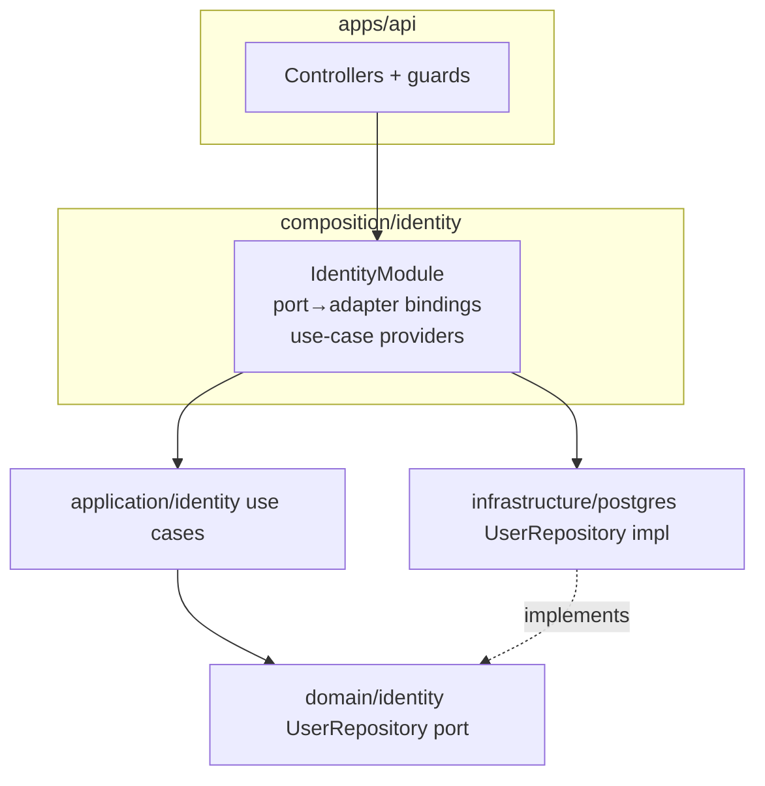

# Backend Architecture

Hexagonal + Clean architecture, organized layer-first (see [`workspace-topology.md`](./workspace-topology.md)), with NestJS confined to the outer ring.

## Layers and the dependency rule

```
apps (api, worker)              ← transport + process entry (LoggerLocator.init, ApiBuilder)
      ↓ imports
nest-http                       ← Nest HTTP kit (pipe/filter/interceptor, Swagger, CORS, versioning)
composition/<context>           ← NestJS modules: wire ports → adapters + use cases
      ↓
infrastructure/{postgres,logger,redis,messaging}  ← adapters (implements ports)
      ↓
application/<context>           ← use cases (@Injectable), orchestration, transactions
      ↓
domain/<context>                ← pure business logic + PORTS (interfaces)
      ↓
shared-kernel-types             ← branded IDs, enums, primitives (leaf)

platform                        ← capability PORTS (Cache/Lock/PubSub/UnitOfWork/Logger locator), inward leaf
```

**The rule:** dependencies always point _down/inward_. `domain` knows nothing about anything above it. This is enforced by Nx tags (see [`boundaries.md`](./boundaries.md)).

## Domain layer (`packages/domain`)

Pure business logic. **Zero framework dependencies** — no NestJS, no TypeORM, no HTTP, no Redis.

Contains, per context folder:

- **Aggregates / entities / value objects** — domain models (plain classes/types), independent of persistence. Aggregates live at the context root (`<aggregate>.ts`, `<aggregate>.types.ts`, `<aggregate>.spec.ts`).
- **Domain events** — emitted by aggregates (event-driven pattern; see [`infrastructure.md`](./infrastructure.md)).
- **Domain errors** — typed, meaningful failures under `<context>/errors/`.
- **Repository ports** — interfaces such as `UserRepository`, `TenantRepository` under `<context>/ports/`. **Decision: repository ports live in the domain layer** (classic DDD). They are interface-only and reference domain models + `shared-kernel-types`, so the domain stays pure.
- **Context-wide catalogs** (authorization only today) — `permission-catalog.ts`, `system-roles.ts` at the context root.
- **`shared-kernel/`** — base `AggregateRoot`, `Entity`, `DomainEvent`, `Result` (backend-only primitives). Unchanged by context layout.

Default layout (kind folders):

```
packages/domain/src/<context>/
  <aggregate>.ts
  <aggregate>.types.ts
  <aggregate>.spec.ts
  errors/*.error.ts
  ports/*.repository.ts
```

Do not pre-create empty `events/`, `value-objects/`, or `aggregates/` folders. Introduce a full DDD catalog inside that context (`aggregates/`, `entities/`, `value-objects/`, `events/`, `errors/`, `ports/`, `services/`) only when complexity actually appears — for example a third aggregate, extracted value objects, typed event classes, or a domain service. Promote one context at a time; other contexts stay on kind folders until they hit the same bar. Isolation lint still keys off the context folder name (`src/<context>/`).

Allowed imports: `shared-kernel-types`, `zod` (pure). Nothing else.

## Application layer (`packages/application`)

Use-case orchestration. This is where a request becomes a sequence of domain operations inside a transaction.

- **Use cases** (a.k.a. application services / interactors), one responsibility each (e.g. `InviteMemberUseCase`, `AssignRoleUseCase`).
- Use cases are **`@Injectable`** — this is the _only_ tolerated framework seam in the application layer (chosen for DI ergonomics). No controllers, no HTTP, no TypeORM, no Redis clients here.
- Owns **transaction boundaries** via the `UnitOfWork` port (see [`persistence.md`](./persistence.md)).
- Owns **fine-grained authorization** checks (see [`authorization.md`](./authorization.md)).
- Consumes **repository ports** (from `domain`) and **capability ports** (from `platform`), including `LoggerLocator.get()` for structured logs. **Do not** `@Inject()` a Logger — it is a process locator, not a Nest provider.
- Receives **command inputs** (plain typed objects), _not_ wire DTOs. Mapping `contracts` DTO → command happens in `apps/api`.
- **Published ports** (`AuthorizationPort`, `MembershipRolesPort`) live in `application/src/shared/` so other contexts import the interface, not a sibling-context file. The authorization **resolver** is an application service composing `RoleRepository` + `MembershipRolesPort` (not a cross-context SQL join, not an infrastructure adapter).

Allowed imports: `domain`, `platform`, `shared-kernel-types`, `utils`, `@nestjs/common` (decorator only).

> Rationale for the `@Injectable` seam: a fully framework-free application layer (manual provider factories) adds wiring boilerplate that obscures the teaching intent of a starter kit. The domain — where purity truly matters — remains 100% framework-free. Recorded in [`decisions.md`](./decisions.md).

## Platform layer (`packages/platform`)

Generic **capability ports** that are technical, not domain concepts:

- `CachePort`, `LockPort`, `PubSubPort` (Redis-backed; see [`infrastructure.md`](./infrastructure.md))
- `UnitOfWork` / `TransactionManager` (see [`persistence.md`](./persistence.md))
- `Clock`, `IdGenerator`, `Logger` (cross-cutting seams)

These are **interfaces + contracts only**. Adapters live in `infrastructure`. `Logger` is reached via `LoggerLocator` on `platform` (process locator), not Nest DI — see [`infrastructure.md`](./infrastructure.md). The domain never imports `platform` for caching/locking (those aren't domain concerns); the **application** layer uses platform ports, and each context's application code decides _policy_ (what to cache, when to lock). Application **may** call `LoggerLocator.get().context(UseCase.name)`.

## Infrastructure layer (`packages/infrastructure/*`)

Adapters that implement ports, split by concern:

- **`postgres`** — TypeORM entities, mappers, repository implementations (implement domain repository ports), a custom `DataSource` module (`DataSourceManager` — not `@nestjs/typeorm`), migrations, the tenant-aware base repository, and the `UnitOfWork` / `TenantContext` adapters (Node `AsyncLocalStorage`, not `nestjs-cls`). See [`persistence.md`](./persistence.md).
- **`logger`** — Pino adapter for the `Logger` port. **No Nest.** Process bootstrap calls `LoggerLocator.init(new PinoLogger(options))`.
- **`redis`** — implementations of `CachePort`/`LockPort`/`PubSubPort`. See [`infrastructure.md`](./infrastructure.md).
- **`messaging`** — BullMQ queues/processors and the outbox relay.

Infrastructure may use NestJS (`@Injectable`, module providers) where it is a Nest adapter (`postgres`). The **logger** adapter does not.

## Nest HTTP kit (`packages/nest-http`)

**Delivery helpers for HTTP apps**, not context DI. Composition wires ports→adapters; `nest-http` owns how a Nest process speaks HTTP.

`@b2b-saas-starter-kit/nest-http` provides:

- `ApiBuilder` — helmet, CORS (fail-closed in production if origins unset), URI versioning (default `'1'` → `/v1/...`), optional global prefix, shutdown hooks, Swagger, listen
- `createHttpProviders()` — global `APP_PIPE` / `APP_FILTER` / `APP_INTERCEPTOR` (nestjs-zod validation + serializer)
- Exception filter — Zod 400s, `HttpException`, duck-typed `{code, message}` mapped with the **contracts** error envelope and `HttpStatus` (no domain error class imports)
- OpenAPI setup (`cleanupOpenApiDoc`); basic-auth on `/docs` optional
- `@Public()` metadata decorator (JWT / `RequirePermission` stay in `apps/api`)
- Process handlers — `unhandledRejection` / `uncaughtException` → `LoggerLocator.get().fatal`

Depends on Nest, `contracts`, `platform` (`LoggerLocator.get`). Does **not** depend on domain, application, or postgres.

`apps/api` `main.ts`: load config → `LoggerLocator.init` → `NestFactory.create` → `new ApiBuilder(app, apiConfig).useSecurity().enableVersioning()…`.

## Composition layer (`packages/composition`)

**The answer to a problem layer-first creates:** a context's NestJS module must assemble that context's `domain` + `application` + `infrastructure`, but there is no single "context project" to hold it. So a dedicated **composition layer** owns the wiring.

Per context, `composition/src/<context>/<context>.module.ts`:

- Binds each **port** to its **adapter** (`{ provide: UserRepository, useClass: TypeOrmUserRepository }`).
- Registers the context's **use cases** as providers.
- Registers **event handlers** / subscribers for the context.
- Exports a NestJS module that apps import.

Apps (`api`, `worker`) import composition modules and add only transport concerns. This keeps wiring written **once** and apps **thin**.



## The role of NestJS

NestJS is the **delivery + composition framework**, nothing more:

- **Controllers** live only in `apps/api` (and BullMQ processors in `apps/worker`). They validate input via the `nest-http` pipe (nestjs-zod against `contracts`), map to commands, invoke use cases, and map results back to responses.
- **Reusable HTTP bootstrap** (versioning, CORS, helmet, Swagger, global pipe/filter/interceptor) lives in `packages/nest-http`.
- **Dependency injection / module composition** lives in `composition` (reusable) and is assembled by the apps.
- **No NestJS in `domain`.** The only NestJS in `application` is the `@Injectable` decorator. **Logger is not a Nest provider.**

This guarantees the domain and (almost all of) the application layer are unit-testable with plain Vitest, no Nest test harness required.

## Request lifecycle (HTTP example)

```
HTTP request  (/v1/…)
  → nest-http global pipe (nestjs-zod vs contracts schema)
  → apps/api coarse permission guard
  → controller maps DTO → application command
  → application use case (@Injectable)
      → LoggerLocator.get().context(…) as needed (not injected)
      → open UnitOfWork (transaction)
      → fine-grained authorization / policy check
      → load aggregates via repository ports
      → execute domain logic (aggregates emit domain events)
      → persist via repository ports; write outbox entries in the same tx
      → commit UnitOfWork
      → dispatch in-process events
  → controller maps result → response DTO (contracts schema)
  → nest-http serializer interceptor + exception filter (contracts error envelope)
HTTP response
```

Background work (`apps/worker`) follows the same inner path but is triggered by a BullMQ job instead of a controller, and re-establishes tenant context from the job payload (see [`multi-tenancy.md`](./multi-tenancy.md)).

## Testing posture (design intent)

- `domain`: pure unit tests, no I/O.
- `application`: unit tests with in-memory port fakes + in-memory `UnitOfWork`.
- `infrastructure`: integration tests against real Postgres/Redis.
- `apps`: e2e tests over HTTP.

(Testing is documented as intent here; test setup is out of scope for this design phase.)
