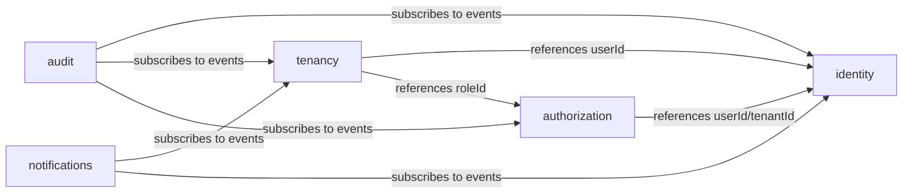

# Bounded Contexts

The logical decomposition of the kit. Each context is a **folder** inside every backend layer project (see [`workspace-topology.md`](./workspace-topology.md)), not its own Nx project.

## The contexts

The kit ships **five** generic contexts. Fine-grained granularity was chosen deliberately: a starter kit's job is to _teach_ clean boundaries, and small single-responsibility contexts best demonstrate bounded-context patterns and cross-context communication.

| Context           | Owns                        | Core aggregates / concepts                                                  |
| ----------------- | --------------------------- | --------------------------------------------------------------------------- |
| **identity**      | Authentication & the person | `User`, credentials, sessions/tokens, email verification, password reset    |
| **tenancy**       | Organizations & belonging   | `Tenant` (organization), `Membership` (User↔Tenant link), invitations      |
| **authorization** | Access rules                | `Role`, `Permission`, role assignments, policies (RBAC + resource policies) |
| **audit**         | Who did what                | `AuditEvent` (append-only), audit trail queries                             |
| **notifications** | Reaching users              | `Notification`, channels (email/in-app), templates, delivery status         |

Cross-cutting technical concerns (config, cache, locks, pub/sub, jobs) are **not** contexts — they are platform/infrastructure capabilities (see [`infrastructure.md`](./infrastructure.md)).

## The relationship chain

```
User (identity)
  └── Membership (tenancy)  ── links a User to a Tenant
        └── Role (authorization) ── assigned per membership (tenant-scoped)
              └── Permission (authorization) ── bundled by roles
```

This chain deliberately spans **three** contexts. That is a feature, not a problem: it forces the kit to demonstrate correct cross-context referencing.

## Context map (how they relate)



- `tenancy` is the relationship hub (memberships link identity + authorization) but references others **only by ID**.
- `audit` and `notifications` are mostly **downstream consumers** that react to events from other contexts.

## Cross-context communication rules

Contexts must not reach into each other's internals. Three sanctioned mechanisms, in order of preference:

1. **Reference by ID (data).** A context stores foreign identifiers (`userId`, `tenantId`, `roleId`) as plain branded values from `shared-kernel-types`. **No cross-context foreign keys**; integrity is maintained by application logic and events. See [`persistence.md`](./persistence.md).

2. **Domain events (async, preferred for reactions).** A context publishes domain events (e.g. `MembershipCreated`, `UserRegistered`); other contexts subscribe via the event bus. Durable/reliable delivery uses the transactional **outbox** (see [`infrastructure.md`](./infrastructure.md)). This is how `audit` and `notifications` stay decoupled.

3. **Calling another context's application API (sync, when necessary).** If a use case genuinely needs another context synchronously, it calls that context's **application-layer use case** through a published interface — never its domain internals, repositories, or entities. Prefer events over this.

**Forbidden:** importing another context's `domain/*` or `infrastructure/*` internals, sharing repositories across contexts, or cross-context DB joins/FKs. These are enforced by the context-isolation lint in [`boundaries.md`](./boundaries.md).

## Why these are contexts (and not one big module)

- Each has a distinct **ubiquitous language** and lifecycle (a `Permission` change and a `Notification` delivery evolve independently).
- Each has a clear **owner boundary** for its data and invariants.
- Keeping them separate makes it obvious where a new feature belongs and prevents the "god module" that the investigated repositories sometimes drifted toward.

## Does a context deserve its own Nx project?

Not by default. Under the chosen **layer-first** topology, a context is a folder, and isolation is enforced by lint. A context should be _promoted_ to its own project(s) only if it needs independent build/versioning or is being extracted toward a separate service — an explicit, later decision, not the starting point. This keeps us on the **modular monolith** path and avoids premature microservices.

## Extension contexts (not in the core kit)

Future products will add contexts (e.g. **billing**, **files/storage**, **webhooks**, **feature-flags**). They follow the same rules: folders across the layers, ID references, events for reactions. The kit's boundaries are designed so adding a context does not require touching existing ones.
