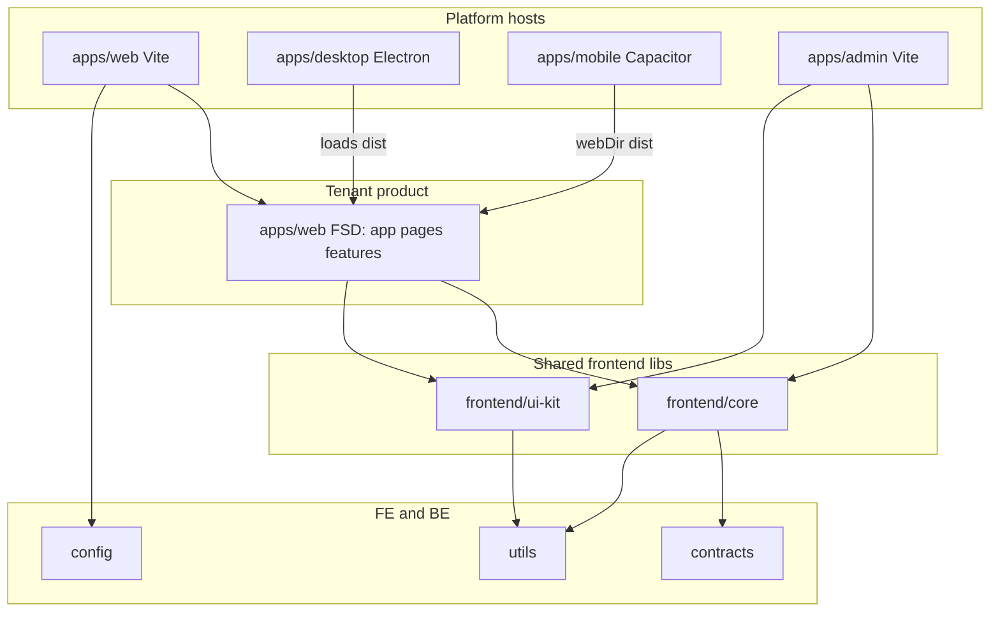

# Frontend foundation across Web, Electron, and Mobile

Investigation only. Existing architecture docs remain the **source of truth**. This document does not replace [`frontend.md`](./frontend.md), [`design-system.md`](./design-system.md), or the ADRs. It adds the **runtime-host** axis (browser vs Electron vs Capacitor) those documents never covered.

**Reference frontend:** `backgammon-fe-new` (React + Vite). Patterns are catalogued, not copied.

**Out of scope here:** ESLint, Prettier, commitlint, Git hooks, Nx/workspace TypeScript/test infrastructure (owned centrally).

---

## 1. What the kit already decided (do not reverse)

From `docs/architecture/` (especially `frontend.md`, `workspace-topology.md`, `boundaries.md`, ADR-021–022, ADR-030):

| Decision                                                                                                        | Implication                                                                                              |
| --------------------------------------------------------------------------------------------------------------- | -------------------------------------------------------------------------------------------------------- |
| Two **audience** apps: `web` (tenant product) and `admin` (back-office)                                         | Different permissions, bundle, deploy cadence                                                            |
| FSD **hybrid**: `ui-kit` + `core` libs; features as **folders in the app** until a second _audience_ needs them | Avoid premature `frontend/feature-*` libs                                                                |
| `frontend/ui-kit` = presentation only; `frontend/core` = RTK / RTK Query / session / `can()`                    | No data fetching in UI; no presentational components in core                                             |
| FE/BE meet only at `contracts`, `shared-kernel-types`, `utils`, `config`                                        | No OpenAPI codegen internally                                                                            |
| Config via `ConfigLoader` at **bootstrap / Vite plugin time**, not import-time                                  | YAML uses `node:fs` — **not** callable in the browser                                                    |
| Design-system **package** exists as a boundary                                                                  | Named `ui-kit`. UI technology is **TBD** (ADR-030). Native `Button` only — no Tailwind, Radix, or theme. |

**Implementation gap:** `packages/frontend/ui-kit` and `packages/frontend/core` do not exist. `apps/web` / `apps/admin` have no FSD folders, Redux, contracts, or ConfigLoader.

The new work is **not** “redesign FSD from Backgammon.” It is: **fit three runtimes onto this already-chosen hybrid without exploding feature copies.**

---

## 2. The main architectural question

There are **two independent axes**:

```text
Audience     web (tenant product)     admin (ops)
Runtime      Browser    Electron      Capacitor
```

ADR-021/022 answer **audience**. They do not answer **runtime**.

If Web, Electron, and Mobile are three full FSD apps, you triplicate members/tenants/me. That fights the stated goal (maximize reuse) and the existing “promote a feature lib only when a second app needs it” rule.

**Recommendation (locked direction for the foundation):**

1. Keep **admin** as a separate Vite app (web-only is enough).
2. Treat **tenant product** as **one React SPA**.
3. Treat Electron and Capacitor as **thin hosts** of that SPA, not sibling products.

```text
packages/frontend/ui-kit      presentation (native Button; UI tech TBD)
packages/frontend/core        store, RTK Query, session, can(), ports
apps/web                      product SPA (FSD: app/pages/features/shared)
apps/admin                    back-office SPA (own FSD folders)
apps/desktop                  Electron main + preload; loads the web build
apps/mobile                   Capacitor shell; webDir = apps/web dist
```

Capacitor and Electron are designed for this: a WebView / `BrowserWindow` loads the same JS/CSS. Platform-only code (secure storage, deep links, window chrome, push, status bar) lives behind **ports in `frontend/core`**, with adapters in the host app.

Do **not** create `apps/electron-src/features/members`. That is the failure mode.

---

## 3. Layering for three runtimes



**Import rule (extends existing docs):** product/feature code may use React, RTK, `contracts`, `ui`, `core`. It must **not** import `@capacitor/*`, `electron`, or `window.electronAPI`. Hosts inject adapters at bootstrap.

That is the same hexagonal idea the backend already uses: ports in an inner lib, adapters at the edge.

---

## 4. Where each concern should live

| Concern                                            | Package / app                                                                  | Why                                        |
| -------------------------------------------------- | ------------------------------------------------------------------------------ | ------------------------------------------ |
| RTK store, base API, 401 refresh, `useCan`, `/me`  | `frontend/core`                                                                | Shared by web + admin + all product hosts  |
| Native `Button` (UI tech TBD)                      | `frontend/ui-kit`                                                              | Shared presentation; **no** RTK            |
| Tenant product screens                             | `apps/web` FSD until admin needs them                                          | Matches ADR-022                            |
| Admin-only screens                                 | `apps/admin` FSD                                                               | Different audience                         |
| Vite `index.html`, Capacitor config, Electron main | Host apps                                                                      | Platform                                   |
| Storage, deep link, window, splash                 | Ports in `core`; adapters in hosts                                             | Isolation                                  |
| Zod wire types                                     | `contracts`                                                                    | Already decided                            |
| Pure helpers                                       | `@b2b-saas-starter-kit/utils`                                                  | Do not fork `shared/utils` from Backgammon |
| YAML/env validation                                | `ConfigLoader` in **Vite plugin / Electron main**, bake result into the bundle | `node:fs` cannot run in renderer/WebView   |

Optional later (only if hosts diverge a lot): `packages/frontend/platform` for port types. Until then, keep ports next to store/API in `core` so you do not add a project prematurely (same “folder until shared” discipline).

---

## 5. Backgammon catalog (reuse vs leave)

For each item: problem, generic?, web-only?, shareable across Web/Electron/Mobile?, Nx package vs app, redesign?

### Vite configuration

- **Problem:** Keep `vite.config` small; env, aliases, plugins, chunking.
- **Generic:** Modular `config/build/*` is useful; Phaser shims, `assetsInlineLimit: 0`, embed multi-entry are not.
- **Web-specific:** Dev server, HTML entries. Electron uses a renderer Vite config; Capacitor consumes the **web build**.
- **Shareable:** A small **Vite plugin** that runs `ConfigLoader` (`source: 'yaml'`) and exposes a virtual module (Backgammon’s `virtual:app-config`). Same plugin for `web` and `admin`. Desktop/mobile reuse the web bundle.
- **Nx package?** Only if the plugin is used by 2+ Vite apps — e.g. `packages/frontend/vite-config` or a file under `config/` (workspace tooling already owns ESLint; this is app-build, not DevEx lint). Prefer **copy-once then extract** rather than a package on day one.
- **Stay in app?** Default: each Vite app’s `vite.config.mts` (already Nx-generated).
- **Redesign:** Yes. Do not copy the 8-file Backgammon tree or `APP_BUILD_TYPE=LIB`. Do not use `@/` as a workspace-wide alias that hides package names; kit rules already prefer `@b2b-saas-starter-kit/*` for libs and optional `@/app` `@/pages` **inside an app**.

### Application bootstrap / providers

- **Problem:** Order: store → i18n ready → theme → router → error boundary.
- **Generic:** Provider stack is the right shape (`frontend.md` “app shell”).
- **Web-specific:** `createRoot`, `document.getElementById`. Identical in Electron renderer and Capacitor WebView.
- **Shareable:** `Providers` composition belongs in `apps/web/src/app` (and admin). Extract to `core` only when admin and product share the exact tree (they likely will not — different router/guards).
- **Stay in app:** Yes (`app/` layer).
- **Redesign:** Drop Backgammon’s `GameRuntimeProvider`, embed `MemoryRouter`, Phaser. Add an explicit **adapter injection** point (`createProductApp({ storage, logger })`) so hosts can pass Capacitor/Electron implementations.

### FSD structure

- **Problem:** Stop circular imports; public APIs per slice.
- **Generic:** `app → pages → features → shared` + `index.ts` barrels.
- **Web-specific:** No.
- **Shareable:** The **rules** are shareable. The **folders** live in `apps/web` / `apps/admin`, not in three runtime apps.
- **Nx package?** Only `ui-kit`, `core`, and later `feature-*` when **admin** (not Electron) needs the same feature.
- **Stay in app:** Product FSD stays in `apps/web`.
- **Redesign:** Do **not** adopt Backgammon’s extra top-level `widgets/`, `entities/`, `game/`, `sdk/` unless you have a canvas/game/embed SDK. Kit `frontend.md` already dropped those layers on purpose. Keep the hybrid.

### `app/` vs `shared/` inside an app

- **Problem:** Wiring vs primitives vs “junk drawer.”
- **Generic:** `app/` = providers/router. `shared/` in an app should stay **thin**; anything reused goes to `ui` / `core` / `utils`.
- **Shareable:** Yes, as a rule.
- **Redesign:** Backgammon `shared/libs` is an in-app framework (i18n, router, redux, api, logger). In the kit that role is **`frontend/core` + `frontend/ui-kit`**, not a fat `apps/web/src/shared/libs`. App `shared/` is leftovers only.

### i18n (logic vs content, lazy locales, typed keys)

- **Problem:** Type-safe keys, code-split languages, React + non-React `t()`.
- **Generic:** The **split** (logic vs `assets/locales`), catalog + dynamic `import()`, i18next module augmentation, `I18nInstance` for non-React — all generic. Namespaces `lobby`/`game` are game-specific.
- **Web-specific:** `i18next-browser-languagedetector` uses `navigator` / `localStorage`. Electron: same Chromium. Capacitor: same WebView; persist language via the **storage port** (not raw `localStorage` if you later use secure storage).
- **Shareable:** Yes, across all three product hosts. Admin can share the engine with different namespace packs.
- **Nx package?** `frontend/core` (engine) + locale **content** in the app that owns copy (`apps/web/src/shared/assets/locales` or `packages/frontend/i18n-content` if admin shares strings). Prefer content in the app until duplication hurts.
- **Not in kit ADRs today.** This is a **new** foundation decision, not a Backgammon copy of namespaces.
- **Redesign:** Keep the architecture; replace game namespaces with SaaS ones (`common`, `auth`, `tenancy`, …). Do not put translation JSON in `utils` (not framework-free in the i18next sense; content is app-owned).

### React Router + typed helpers

- **Problem:** Typos in paths; invalid `:id` should be a typed error, not a blank page.
- **Generic:** `paths` const, `buildPath`, `PathParams<P>`, Zod-validated `useRouteParams`.
- **Web-specific:** `createBrowserRouter` needs a real HTTP origin + history. **Electron `file://`** often wants **HashRouter** or a custom protocol. **Capacitor** usually uses Browser history if the WebView has a local server / `server.url`, else hash routing.
- **Shareable:** Path constants + builders in `apps/web` (product routes) or `core` if admin shares some routes (unlikely). Router **factory** (`createBrowserRouter` vs `createHashRouter`) is a **host adapter**.
- **Stay in app:** Product routes in `apps/web/src/app`. Typed helpers can live in `core` if both apps use them.
- **Redesign:** Yes for history mode. Do not hard-code `createBrowserRouter` inside feature code.

### Errors, boundaries, categories

- **Problem:** Distinguishing programmer errors vs recoverable domain/router errors; log + fallback UI.
- **Generic:** Base `AppError` + codes; class Error Boundary; i18n fallbacks.
- **Shareable:** Boundary + taxonomy in `core` (or `ui` for fallback chrome only). Map **HTTP error envelope** from `contracts` (`code`, `message`) in the RTK base query — that is kit-specific, not Backgammon’s Accounting XML.
- **Stay in app:** Fallback layout that uses `ui`.
- **Redesign:** Replace `BackofficeError` / game names. Align categories with backend codes (`UNAUTHORIZED`, `INSUFFICIENT_PERMISSION`, `VALIDATION_ERROR`, …) already in the API filter. Do not invent a parallel FE-only code list for the same wire errors.

### Logging (dev vs prod)

- **Problem:** Quiet production console; still capture errors.
- **Generic:** Small logger façade.
- **Web-specific:** `console` in renderer. Electron main process is Node (different sink). Capacitor can later plug Crashlytics/Sentry.
- **Shareable:** A **frontend logger port** in `core` (not backend Pino / `LoggerLocator` — those are `scope:backend`). Adapters: `console` (dev), no-op or remote (prod), optional Electron `electron-log` in **desktop host only**.
- **Redesign:** Backgammon’s “all levels no-op in prod” is too weak for SaaS (you want `error` in prod). Mirror backend levels conceptually (`debug`/`info`/`warn`/`error`) without importing Pino.

### Custom hooks

- **Problem:** Debounce, dialog state, media query, etc.
- **Generic:** Most of Backgammon’s `shared/libs/react` hooks.
- **Shareable:** Put **framework-free** helpers in `utils` if they have no React; React hooks in `core` or `ui` (UI hooks like `useDialogState` → `ui`).
- **Stay in app:** One-off feature hooks.
- **Do not copy:** `useDisableContextMenu` as a global default (product choice, not a kit invariant).

### API client / RTK Query

- **Problem:** One HTTP client, typed endpoints, cache tags, auth headers.
- **Generic:** Empty `createApi` + `injectEndpoints` — **already chosen** in `frontend.md`.
- **Web-specific:** `fetch` works in all three Chromium WebViews.
- **Shareable:** Base API in `core`. Feature endpoints: product features in `apps/web` until admin shares them.
- **Do not copy:** Axios + MD5 + XML `soservice`. Kit API is JSON `/v1` + Zod contracts.
- **Redesign:** `baseUrl` must not be only `import.meta.env.VITE_API_URL`. Packaged Electron/mobile need **runtime or build-time config** (see config below). `prepareHeaders` should read token/tenant from the store (already in the doc). Token **persistence** goes through a storage port.

### Redux Toolkit

- **Problem:** Session + UI state next to server cache.
- **Generic:** `configureStore`, typed `useAppDispatch` / `useAppSelector`.
- **Shareable:** Store factory in `core` (accept extra slices/middleware from the app).
- **Do not copy:** `redux-persist` on session **until** the storage port exists — `localStorage` is wrong for some mobile/desktop threat models. Persist theme is optional.
- **Do not copy:** Dual store (Phaser runtime + Redux projection). Irrelevant to this SaaS.

### Frontend configuration / environment

- **Problem:** Typed config, local overrides, no secret sprawl.
- **Generic:** Zod schema + merge; Backgammon YAML + virtual module matches kit `ConfigLoader` **if invoked at Vite build**.
- **Not browser-safe:** `YamlConfigSource` uses `node:fs`.
- **Shareable:** Schema in the app (`apps/web/src/app/config/web-config.schema.ts`). Load in `vite.config.mts`. Inject `import.meta.env` or virtual module.
- **Hosts:** Electron **main** may load YAML/env again for `API_URL` overrides. Capacitor typically **bakes** config at `nx build web`.
- **Redesign:** Prefer kit `ConfigLoader` over a one-off YAML parser. Do not call `ConfigLoader` from React modules.

### Testing (app-level only)

- **Problem:** Render with store + router without repeating setup.
- **Generic:** `renderWithProviders`, `createTestStore`, MSW handlers typed with **contracts**.
- **Shareable:** `frontend/core/testing` export (kit already uses `./testing` on postgres).
- **Stay in app:** MSW handler lists for pages.
- **Redesign:** Include `IntlProvider` if i18n is in the stack (Backgammon omitted it). MSW is already in kit testing rules.

### Path aliases

- **Problem:** Short imports.
- **Kit already:** packages via `@b2b-saas-starter-kit/*`; in-app FSD `@/app`, `@/pages`, `@/features`, `@/shared` (cursor `path-aliases` rule).
- **Do not copy:** `@/game/runtime` deep aliases; do not use `@/` to import other Nx projects.

### Other (theme, forms, toast, embed SDK)

| Item                            | Verdict                                                                                                                                                                                      |
| ------------------------------- | -------------------------------------------------------------------------------------------------------------------------------------------------------------------------------------------- |
| Theme tokens / `ThemeProvider`  | **Deferred.** Package is `ui-kit` with a native `Button` only (ADR-030). No Tailwind/Radix/tokens until a later ADR. White-label theming remains a product goal, not current implementation. |
| RHF + Zod                       | Optional later; validate with **contracts** schemas. App or `ui` form wrappers — not `utils`.                                                                                                |
| Toast                           | `ui` primitive when you pick a toast implementation.                                                                                                                                         |
| Embed iframe SDK                | Do not bring over. Optional later as its own app/lib.                                                                                                                                        |
| Phaser / WebSocket game runtime | Out of scope.                                                                                                                                                                                |

---

## 6. Platform isolation (what actually differs)

| Concern                         | Web                           | Electron                                | Capacitor                           |
| ------------------------------- | ----------------------------- | --------------------------------------- | ----------------------------------- |
| UI + RTK + routes               | Same SPA                      | Same renderer                           | Same WebView                        |
| History API                     | `BrowserRouter`               | Often hash or `app://`                  | Browser or hash                     |
| Token storage                   | memory + cookie / web storage | `safeStorage` / OS keychain via preload | Preferences / Secure Storage plugin |
| Deep links                      | HTTPS                         | custom protocol                         | App Links / universal links         |
| Config                          | Vite bake + `VITE_*`          | bake + optional main-process override   | bake at web build                   |
| Window / menu / updater         | n/a                           | main process                            | n/a                                 |
| Push / status bar / back button | n/a                           | n/a                                     | plugins                             |
| Logging sink                    | console / Sentry              | + file log in main                      | + native crash                      |

**Port sketch (in `core`, no Capacitor/Electron types):**

```text
StoragePort        get/set/remove (session, locale)
LinkingPort        subscribe to inbound URLs
WindowPort         optional: setTitle, minimize (no-ops on web)
LoggerPort         already above
```

Web adapters: `localStorage` / memory. Desktop/mobile adapters: live in `apps/desktop` and `apps/mobile`, passed into `createStore` / `Providers`.

---

## 7. Tension with existing docs (call these out before coding)

1. **ADR-022 “second app”** currently means **admin**, not Electron. Document that **runtime hosts do not count** as a reason to extract `feature-*` libs. Admin still does.
2. **ADR-023** (shadcn + Radix + Tailwind) is **superseded by ADR-030**. Keep the **`frontend/ui-kit` project**; do **not** add tokens/`ThemeProvider`/Radix as placeholders.
3. **`frontend.md` `import.meta.env.VITE_API_URL`** is insufficient for packaged clients. Extend to ConfigLoader-at-build + optional runtime override on desktop.
4. **i18n** is unused in kit ADRs (only mentioned in the old engineering investigation). If product copy ships on day one of the FE foundation, add a short ADR: i18next, lazy packs, typed keys, content in the app.
5. **No Electron/Capacitor** in topology/boundaries. Adding `apps/desktop` and `apps/mobile` as `scope:frontend` `type:app` is compatible with existing `type:app` constraints (they may depend on `ui`, `core`, `contracts`, `config`, …). They must **not** depend on `nest-http` / `composition`.
6. **Overview.md “two apps: web, admin”** stays true for **audiences**. Runtimes are extra hosts of `web`.

---

## 8. What to implement first (when leaving investigation)

Suggested order, still design-level:

1. Create **`frontend/core`** (store factory, empty RTK API, session slice, `can()`, logger + storage **ports** with web adapters) and **`frontend/ui-kit`** as a real package exporting a native `Button` (no component-library choice, no theme).
2. Grow **`apps/web`** into FSD (`app` providers, router factory, pages, one vertical feature talking to `/v1` via contracts).
3. Vite plugin: **ConfigLoader yaml → virtual module** for `web` (and later `admin`).
4. Typed i18n (Backgammon-shaped, SaaS namespaces) if you want copy in the foundation.
5. Error boundary + map `contracts` error envelope in `baseQuery`.
6. **`apps/desktop` / `apps/mobile` as empty hosts** that load `web` dist — prove the “one SPA” rule before native plugins.
7. `apps/admin` shell when back-office UI starts — still a separate audience app.

Do not start by cloning Backgammon’s `src/shared/libs` tree into the kit.

---

## 9. Direct answers

**How should frontend architecture work across Web, Electron, and Mobile?**

One **tenant product SPA** (`apps/web` FSD + `frontend/core` + `frontend/ui-kit`), wrapped by Electron and Capacitor. **Admin** stays a second Vite app. Platform differences are **injected adapters**, not forked features. Shared FE/BE types stay in **`contracts`**. Config is **build-time `ConfigLoader`**, not in-browser YAML. i18n, typed routes, error boundaries, and RTK Query `injectEndpoints` are worth taking from Backgammon **as patterns**; Phaser, Accounting Axios, embed SDK, and fat in-app `shared/libs` are not.

Existing kit docs remain primary; this investigation only adds the **runtime-host** axis they never covered.
