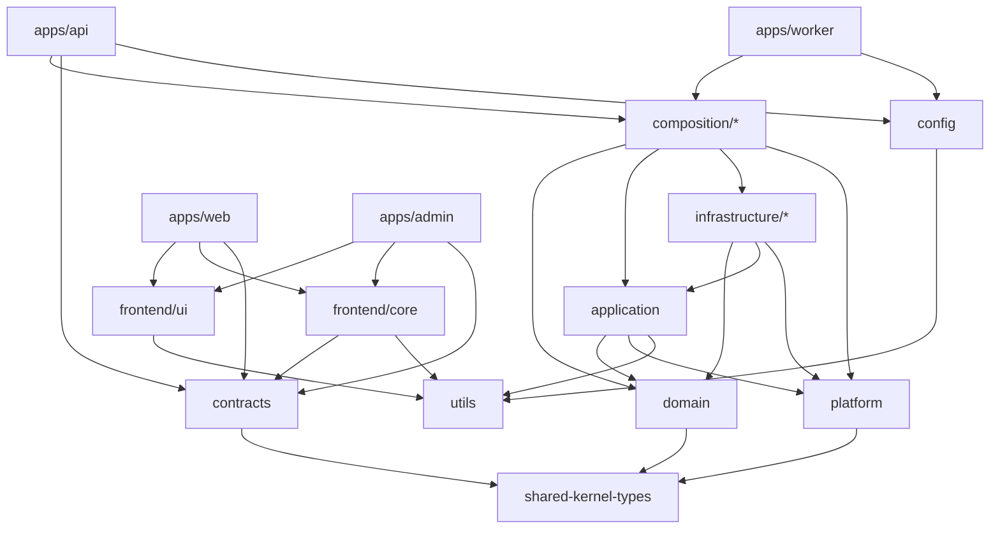

# Workspace Topology

How the logical architecture maps onto physical Nx projects. This is the answer to _"what is a project, what is a library, what is an app, and what is just a folder?"_

See also: [`boundaries.md`](./boundaries.md) for the tags/constraints that enforce this, and [`decisions.md`](./decisions.md) for rejected alternatives.

## The mapping model: layer-first with contexts as folders

**Decision:** The Nx _projects_ are the architectural **layers**. The bounded **contexts** are _folders_ inside each layer project.

```
packages/
  # ── shared (scope:shared) — pure, framework-free, usable by BE and FE ──
  shared/
    utils/                 # ObjectUtils, ArrayUtils, DateUtils, …  → @b2b-saas-starter-kit/utils
    config/                # ConfigLoader (YAML + Zod)               → @b2b-saas-starter-kit/config
  shared-kernel-types/     # branded IDs, cross-cutting enums, primitive scalars     [leaf]
  contracts/               # Zod API request/response schemas + inferred types

  # ── backend (scope:backend) ──
  domain/                  # layer:domain — pure business logic + repository ports
    src/
      identity/
      tenancy/
      authorization/
      audit/
      notifications/
      shared-kernel/       # base AggregateRoot / Entity / DomainEvent / Result (backend-only)
  application/             # layer:application — use cases (@Injectable), app services
    src/
      identity/ …
      shared/              # cross-context application helpers
  platform/                # layer:platform — capability PORTS: Cache/Lock/PubSub/UnitOfWork
  infrastructure/          # layer:infrastructure — adapters (grouping directory)
    postgres/              #   TypeORM entities, mappers, repo impls, DataSource, migrations, tenant base repo
    redis/                 #   Redis adapters for the platform capability ports
    messaging/             #   BullMQ + outbox relay
  composition/             # layer:composition — per-context NestJS modules (DI wiring)
    src/
      identity/ …

  # ── frontend (scope:frontend) ──
  frontend/
    ui/                    # design system (see design-system.md)
    core/                  # RTK store, RTK Query base, auth/tenant/permission state, can()

apps/
  api/                     # NestJS HTTP — thin: transport + composition
  worker/                  # BullMQ consumers + outbox relay — thin
  web/                     # React + Vite — tenant-facing app
  admin/                   # React + Vite — back-office app
```

### Why layer-first (and what we gave up)

**Chosen** because it keeps the project count low and makes the **layer dependency rule** the primary, Nx-enforced invariant. The dependency rule is the thing most worth guaranteeing at build time.

**Trade-off accepted:** contexts live inside shared layer projects, so:

- Nx cannot separate contexts as projects → **context isolation is a lint rule** (see [`boundaries.md`](./boundaries.md)).
- `nx affected` recomputes at layer granularity (touching any `domain/**` marks the `domain` project affected).

Rejected alternatives (context-first single project per context; context×layer projects) are documented with their trade-offs in [`decisions.md`](./decisions.md).

### Note on `infrastructure/*` realization

`infrastructure/` is a **grouping directory**. `postgres`, `redis`, and `messaging` are split by concern because they have different dependency footprints and change cadences. Two valid realizations exist:

- **(a) Separate Nx projects:** `infrastructure-postgres`, `infrastructure-redis`, `infrastructure-messaging` — best `affected` granularity; a context needing only Redis won't pull TypeORM.
- **(b) One `infrastructure` project with subfolders** — fewer projects; coarser affected.

Default recommendation: **(a)** for postgres/messaging (heaviest, most-coupled) and Redis, but either is compatible with the architecture. The same "grouping dir may be one project or several" principle applies to `frontend/`.

## Project roles

| Project               | Type | Layer          | Depends on (allowed)                                           |
| --------------------- | ---- | -------------- | -------------------------------------------------------------- |
| `shared-kernel-types` | lib  | shared         | — (leaf; +Zod)                                                 |
| `contracts`           | lib  | shared         | `shared-kernel-types`                                          |
| `utils`               | lib  | shared         | —                                                              |
| `config`              | lib  | shared         | `utils` (+ Zod, js-yaml)                                       |
| `domain`              | lib  | domain         | `shared-kernel-types`                                          |
| `application`         | lib  | application    | `domain`, `platform`, `shared-kernel-types`, `utils`           |
| `platform`            | lib  | platform       | `shared-kernel-types`                                          |
| `infrastructure/*`    | lib  | infrastructure | `domain`, `application`, `platform`, shared libs               |
| `composition/*`       | lib  | composition    | `domain`, `application`, `infrastructure`, `platform`          |
| `frontend/ui`         | lib  | ui             | `utils` (+ React/Radix/Tailwind)                               |
| `frontend/core`       | lib  | feature/core   | `contracts`, `shared-kernel-types`, `utils`                    |
| `apps/api`            | app  | app            | `composition`, `contracts`, `config`, `utils`                  |
| `apps/worker`         | app  | app            | `composition`, `config`, `utils`                               |
| `apps/web`            | app  | app            | `frontend/ui`, `frontend/core`, `contracts`, `utils`, `config` |
| `apps/admin`          | app  | app            | same as `web`                                                  |

## Dependency graph (the DAG)



**Key invariants**

- `domain` depends on **nothing** except `shared-kernel-types` (and Zod). It never imports `contracts`, `application`, `infrastructure`, or any framework.
- `application` never imports `contracts` or `infrastructure`. It receives **command inputs**, not wire DTOs (mapping happens in `apps/api`). See [`api-contracts.md`](./api-contracts.md).
- Frontend and backend never import each other. They meet only at `contracts`, `shared-kernel-types`, `utils`, `config`.

## What is a project vs. a folder

- **Project** (has `package.json` + `tsconfig`): a _layer_ (`domain`), an _infra concern_ (`infrastructure-postgres`), a _shared leaf_ (`contracts`), a _frontend lib_ (`ui`), or an _app_.
- **Folder** (no project boundary): a _bounded context_ inside a layer (`domain/src/identity`), an _aggregate_, a _use case_, an FSD _feature_ inside an app.

Guideline: promote a folder to a project only when it must be (a) independently versioned/built, (b) shared across apps, or (c) boundary-enforced by Nx. Frontend features start as folders and become libs only when a second app needs them (see [`frontend.md`](./frontend.md)).

## Applications

Apps are **thin**: transport + composition, **no business logic**.

- `api` — NestJS HTTP. Imports `composition` context modules, exposes controllers, maps `contracts` DTOs → application commands, applies coarse auth guards.
- `worker` — BullMQ consumers + the outbox relay. Imports the same `composition` modules; re-establishes tenant context from job payloads.
- `web` — tenant-facing React/Vite app.
- `admin` — internal back-office React/Vite app.

A realtime `gateway` (WebSocket) app is **deferred**; realtime can initially ride on `api` + Redis pub/sub. See [`decisions.md`](./decisions.md).
