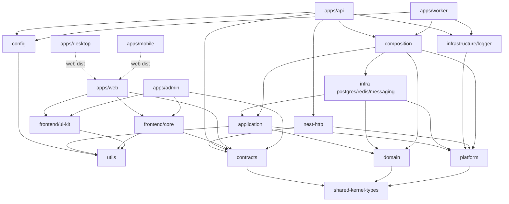

# Workspace Topology

How the logical architecture maps onto physical Nx projects. This is the answer to _"what is a project, what is a library, what is an app, and what is just a folder?"_

See also: [`boundaries.md`](./boundaries.md) for the tags/constraints that enforce this, and [`decisions.md`](./decisions.md) for rejected alternatives.

## The mapping model: layer-first with contexts as folders

**Decision:** The Nx _projects_ are the architectural **layers**. The bounded **contexts** are _folders_ inside each layer project.

```
packages/
  # ── shared (scope:shared) — pure, framework-free, usable by BE and FE ──
  shared/
    kernel-types/          # branded IDs, cross-cutting enums, primitive scalars     → @b2b-saas-starter-kit/shared-kernel-types
    contracts/             # Zod API request/response schemas + inferred types       → @b2b-saas-starter-kit/contracts
    utils/                 # ObjectUtils, ArrayUtils, DateUtils, …  → @b2b-saas-starter-kit/utils
    config/                # ConfigLoader (YAML + Zod)               → @b2b-saas-starter-kit/config

  # ── backend (scope:backend) ──
  domain/                  # layer:domain — pure business logic + repository ports
    src/
      identity/
      tenancy/
      authorization/
      audit/
      notifications/
      shared-kernel/       # base AggregateRoot / Entity / DomainEvent / Result (backend-only)
  application/             # layer:application — use cases (@Injectable), app services
    src/
      identity/ …
      shared/              # cross-context application helpers
  platform/                # layer:platform — capability PORTS: Cache/Lock/PubSub/UnitOfWork/Logger
  infrastructure/          # layer:infrastructure — adapters (grouping directory)
    postgres/              #   TypeORM entities, mappers, repo impls, DataSource, migrations, tenant base repo
    logger/                #   Pino adapter for the Logger port (no Nest)
    redis/                 #   Redis adapters for the platform capability ports
    messaging/             #   BullMQ + outbox relay
  nest-http/               # layer:nest-http — Nest HTTP kit (ApiBuilder, pipe/filter/interceptor, Swagger)
  composition/             # layer:composition — per-context NestJS modules (DI wiring)
    src/
      identity/ …

  # ── frontend (scope:frontend) ──
  frontend/
    ui-kit/                # presentation package; UI tech TBD (see design-system.md)
    core/                  # RTK store, RTK Query base, auth/tenant/permission state, can()

apps/
  api/                     # NestJS HTTP — thin: transport; bootstraps nest-http + composition
  worker/                  # BullMQ consumers + outbox relay — thin; bootstraps Logger
  web/                     # React + Vite — tenant-facing product SPA
  admin/                   # React + Vite — back-office audience app
  desktop/                 # Electron main + preload; loads `apps/web` dist (no product FSD)
  mobile/                  # Capacitor config; `webDir` = `apps/web` dist (no product FSD)
```

### Why layer-first (and what we gave up)

**Chosen** because it keeps the project count low and makes the **layer dependency rule** the primary, Nx-enforced invariant. The dependency rule is the thing most worth guaranteeing at build time.

**Trade-off accepted:** contexts live inside shared layer projects, so:

- Nx cannot separate contexts as projects → **context isolation is a lint rule** (see [`boundaries.md`](./boundaries.md)).
- `nx affected` recomputes at layer granularity (touching any `domain/**` marks the `domain` project affected).

Rejected alternatives (context-first single project per context; context×layer projects) are documented with their trade-offs in [`decisions.md`](./decisions.md).

### Note on `infrastructure/*` realization

`infrastructure/` is a **grouping directory** (`packages/infrastructure/postgres`, `packages/infrastructure/logger`, `packages/infrastructure/redis`, later `messaging`). Each concern is its own Nx project because they have different dependency footprints and change cadences. That is the default:

- **Disk:** `packages/infrastructure/<concern>/` (mirrors `packages/shared/<leaf>/`).
- **Nx / npm:** concern name (`postgres` / `@b2b-saas-starter-kit/postgres`; `logger` / `@b2b-saas-starter-kit/logger`; `redis` / `@b2b-saas-starter-kit/redis`; later `messaging`) so a Redis or logger consumer never pulls TypeORM, and a worker never pulls Nest/Swagger. `apps/api` must not import `redis` — composition owns the adapter.

A single `infrastructure` project with subfolders is a valid alternative (fewer projects, coarser `affected`) but is not what this kit ships. The same "grouping dir may be one project or several" principle applies to `frontend/`.

## Project roles

| Project               | Type | Layer          | Depends on (allowed)                                                             |
| --------------------- | ---- | -------------- | -------------------------------------------------------------------------------- |
| `shared-kernel-types` | lib  | shared         | — (leaf; +Zod)                                                                   |
| `contracts`           | lib  | shared         | `shared-kernel-types`                                                            |
| `utils`               | lib  | shared         | —                                                                                |
| `config`              | lib  | shared         | `utils` (+ Zod, js-yaml)                                                         |
| `domain`              | lib  | domain         | `shared-kernel-types`                                                            |
| `application`         | lib  | application    | `domain`, `platform`, `shared-kernel-types`, `utils`                             |
| `platform`            | lib  | platform       | `shared-kernel-types`                                                            |
| `infrastructure/*`    | lib  | infrastructure | `domain`, `application`, `platform`, shared libs                                 |
| `logger`              | lib  | infrastructure | `platform` (Pino adapter; no Nest, no domain)                                    |
| `nest-http`           | lib  | nest-http      | `contracts`, `platform`, shared (`config`/`utils` as needed)                     |
| `composition`         | lib  | composition    | `domain`, `application`, `infrastructure`, `platform`                            |
| `frontend/ui-kit`     | lib  | ui             | `utils` (+ React). **Not** Tailwind / Radix / theme.                             |
| `frontend/core`       | lib  | feature/core   | `contracts`, `shared-kernel-types`, `utils`                                      |
| `apps/api`            | app  | app            | `nest-http`, `composition`, `contracts`, `config`, `utils`, `logger` (bootstrap) |
| `apps/worker`         | app  | app            | `composition`, `config`, `utils`, `logger` (bootstrap)                           |
| `apps/web`            | app  | app            | `frontend/ui-kit`, `frontend/core`, `contracts`, `utils`, `config`               |
| `apps/admin`          | app  | app            | same as `web`                                                                    |
| `apps/desktop`        | app  | app            | Electron only; **Nx** `implicitDependencies: ["web"]` (no TS import of `web`)    |
| `apps/mobile`         | app  | app            | Capacitor config; same implicit `web` artifact edge                              |

## Dependency graph (the DAG)



**Key invariants**

- `domain` depends on **nothing** except `shared-kernel-types` (and Zod). It never imports `contracts`, `application`, `infrastructure`, or any framework.
- `application` never imports `contracts` or `infrastructure`. It receives **command inputs**, not wire DTOs (mapping happens in `apps/api`). Logging uses `LoggerLocator.get()` from `platform` (process locator), not a Pino import. See [`api-contracts.md`](./api-contracts.md).
- Frontend and backend never import each other. They meet only at `contracts`, `shared-kernel-types`, `utils`, `config`.
- `apps/api` does **not** import `domain`, `application`, or `postgres`. Delivery helpers come from `nest-http`; use cases are reached through `composition`.

## What is a project vs. a folder

- **Project** (has `package.json` + `tsconfig`): a _layer_ (`domain`), an _infra concern_ (`packages/infrastructure/postgres`), a _shared leaf_ (`contracts`), a _frontend lib_ (`ui-kit`), or an _app_.
- **Folder** (no project boundary): a _bounded context_ inside a layer (`domain/src/identity`), an _aggregate_, a _use case_, an FSD _feature_ inside an app.

Guideline: promote a folder to a project only when it must be (a) independently versioned/built, (b) shared across apps, or (c) boundary-enforced by Nx. Frontend features start as folders and become libs only when a second app needs them (see [`frontend.md`](./frontend.md)).

## Applications

Apps are **thin**: transport + composition, **no business logic**.

- `api` — NestJS HTTP. Bootstraps Pino via `LoggerLocator.init`, then `ApiBuilder` from `@b2b-saas-starter-kit/nest-http` (URI versioning, CORS, helmet, Swagger, global pipe/filter/interceptor). Imports `composition` context modules, exposes controllers, maps `contracts` DTOs → application commands, applies coarse auth guards. Routes are versioned (`/v1/...`).
- `worker` — BullMQ consumers + the outbox relay. Bootstraps the same `Logger` locator. Imports the same `composition` modules; re-establishes tenant context from job payloads. Does **not** import `nest-http`.
- `web` — tenant-facing React/Vite product SPA.
- `admin` — internal back-office React/Vite audience app.
- `desktop` — Electron main + preload. Loads `apps/web` dist; no product FSD.
- `mobile` — Capacitor shell. `webDir` points at `apps/web` dist; no product FSD.

Runtime hosts (`desktop`, `mobile`) wrap the web **artifact**. They must not import `@b2b-saas-starter-kit/web` (`type:app → type:app`). Nx `implicitDependencies` records the build-order edge only.

A realtime `gateway` (WebSocket) app is **deferred**; realtime can initially ride on `api` + Redis pub/sub. See [`decisions.md`](./decisions.md).
